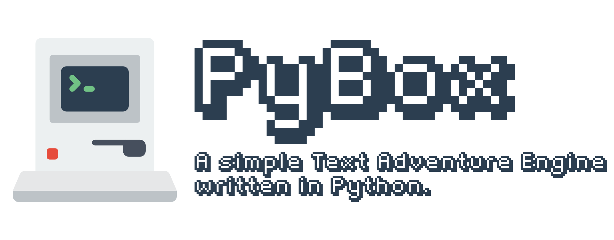

.. PyBox documentation master file, created by
   sphinx-quickstart on Fri Nov  6 11:37:12 2020.
   You can adapt this file completely to your liking, but it should at least
   contain the root `toctree` directive.

Welcome to PyBox's documentation!
=================================

.. toctree::
   :maxdepth: 2
   :caption: Contents:

   guide/index
   design_docs/index
   api/index

Indices and tables
==================

* :ref:`genindex`
* :ref:`modindex`
* :ref:`search`
